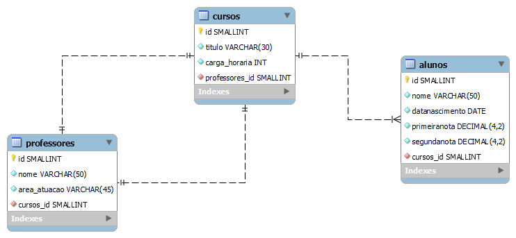

# tecinternet_escola_thais

## Exercício
Modelagem física



### Comandos Etapa 3

1. Faça uma consulta que mostre os alunos que nasceram antes do ano 2009

```sql
SELECT nome, data_nascimento FROM alunos WHERE data_nascimento < '2009-01-01';
```
---

2. Faça uma consulta que calcule a média das notas de cada aluno e as mostre com duas casas decimais.
```sql
SELECT 
    nome, 
    ROUND((primeiranota + segundanota) / 2, 2) AS media
FROM alunos;
```
---

3. Faça uma consulta que calcule o limite de faltas de cada curso de acordo com a carga horária. Considere o limite como 25% da carga horária. Classifique em ordem crescente pelo título do curso.
```sql
SELECT cursos.titulo as Cursos, 
cursos.carga_horaria, 
ROUND(cursos.carga_horaria * 0.25) as Limite_de_Faltas 
FROM cursos 
ORDER BY cursos.titulo;
```
---

4. Faça uma consulta que mostre os nomes dos professores que são somente da área "desenvolvimento".
```sql
SELECT 
    professores.nome as Professores,
    professores.area_atuacao as "Área"
FROM professores
WHERE area_atuacao = "Desenvolvimento";
```
---

5. Faça uma consulta que mostre a quantidade de professores que cada área ("design", "infra", "desenvolvimento") possui.
```sql
SELECT area_atuacao, 
COUNT(*) AS professores FROM professores 
WHERE area_atuacao IN ('design', 'infra', 'desenvolvimento') 
GROUP BY area_atuacao;
```
---

6. Faça uma consulta que mostre o nome dos alunos, o título e a carga horária dos cursos que fazem.

```sql
SELECT alunos.nome as Alunos, 
alunos.curso_id as Curso, 
cursos.carga_horaria as 'Carga Horária' 
FROM alunos INNER JOIN cursos 
ON alunos.curso_id = cursos.id 
GROUP BY Alunos;
```
---


7. Faça uma consulta que mostre o nome dos professores e o título do curso que lecionam. Classifique pelo nome do professor.
```sql
SELECT professores.nome as Professores, 
cursos.titulo as Curso 
FROM professores INNER JOIN cursos 
ON professores.id_curso = cursos.id 
GROUP BY Professores;
```
---

8. Faça uma consulta que mostre o nome dos alunos, o título dos cursos que fazem, e o professor de cada curso.
```sql
SELECT alunos.nome as Aluno,
       cursos.titulo as Curso,
       professores.nome as Professor
FROM alunos
INNER JOIN cursos ON alunos.curso_id = cursos.id
INNER JOIN professores ON cursos.id_professor = professores.id
GROUP BY Aluno, Curso, Professor;

```
---


9. Faça uma consulta que mostre a quantidade de alunos que cada curso possui. Classifique os resultados em ordem descrecente de acordo com a quantidade de alunos.
```sql
SELECT cursos.titulo as Cursos,
       COUNT(*) AS Alunos
FROM alunos
INNER JOIN cursos ON alunos.curso_id = cursos.id
GROUP BY cursos.titulo  
ORDER BY `Alunos` DESC;
```
---


10. Faça uma consulta que mostre o nome dos alunos, suas notas, médias, e o título dos cursos que fazem. Devem ser considerados somente os alunos de Front-End e Back-End. Mostre os resultados classificados pelo nome do aluno.
```sql
SELECT alunos.nome as Alunos, 
alunos.primeiranota as 'Primeira Nota',
alunos.segundanota as 'Segunda Nota',
ROUND((primeiranota + segundanota) / 2, 2) AS Media,
cursos.titulo as Cursos
FROM alunos INNER JOIN cursos
WHERE curso_id = 1 OR curso_id = 2
GROUP BY Alunos;
```
---


11. Faça uma consulta que altere o nome do curso de Figma para Adobe XD e sua carga horária de 10 para 15.
```sql
UPDATE cursos SET titulo = 'Adobe XD', carga_horaria = 15 WHERE titulo = 'Figma';
```
---

12. Faça uma consulta que exclua um aluno do curso de Redes de Computadores e um aluno do curso de UX/UI.
```sql
DELETE FROM alunos WHERE id = 67 AND curso_id = 5;
DELETE FROM alunos WHERE id = 62 AND curso_id = 3;
```
---

13. Faça uma consulta que mostre a lista de alunos atualizada e o título dos cursos que fazem, classificados pelo nome do aluno.
```sql
SELECT alunos.nome as Alunos,
cursos.titulo as Cursos
FROM alunos INNER JOIN cursos
ON alunos.curso_id = cursos.id
GROUP BY alunos.nome;
```
---

### DESAFIOS
1. Criar uma consulta que calcule a idade do aluno

```sql 
SELECT
    alunos.nome AS Aluno,
    alunos.data_nascimento as 'Data de Nascimento',
    FLOOR(DATEDIFF(CURRENT_DATE, data_nascimento) / 365) AS idade
FROM alunos;
```
---


2. Criar uma consulta que calcule a média das notas de cada aluno e mostre somente os alunos que tiveram a média maior ou igual a 7.
SELECT 
```sql
SELECT 
    alunos.nome as Alunos, 
    ROUND((primeiranota + segundanota) / 2, 2) AS Media
FROM alunos
WHERE (primeiranota + segundanota) / 2 >= 7;
```
---


3. Criar uma consulta que calcule a média das notas de cada aluno e mostre somente os alunos que tiveram a média menor que 7.
```sql
SELECT 
    alunos.nome as Alunos, 
    ROUND((primeiranota + segundanota) / 2, 2) AS Media
FROM alunos
WHERE (primeiranota + segundanota) / 2 <= 7;
```
---


4. Criar uma consulta que mostre a quantidade de alunos com média maior ou igual a 7.
```sql
SELECT 
    COUNT(*) AS 'Alunos Aprovados'                                                              
FROM alunos
WHERE (primeiranota + segundanota) / 2 >= 7;
```
---